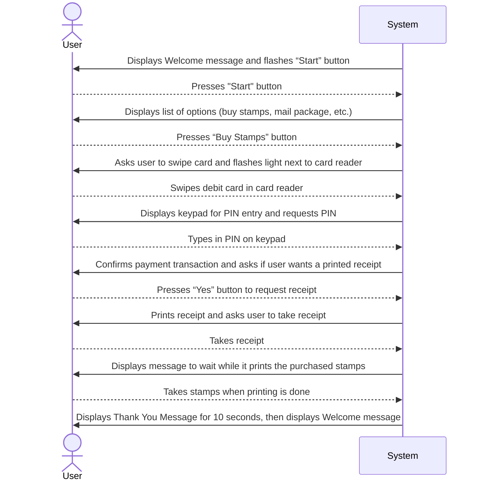

# Executive Summary
> A summary of all the essential information in the proposal so that a busy executive can read it quickly and decide what parts of the plan to read in more depth.

# System Request

**Project Sponsor:** Carmella Herrera, General Manager, Client Services Business Unit

**Business Need:** This project has been initiated to create the capability of clients requesting drone flight service and data analysis through the company website. The capability is an essential element in the business model of the newly formed Client Services business unit.

**Business Requirements:** Using this system from our company website, clients will be able to request specific drone flight services and data analysis. A request will be offered to any contracted DrōnTeq drone pilots in the vicinity, who can submit bids during the bidding window. Once the bidding window closes, the pilot with the “winning” bid will be assigned the request.

**Business Value:** The Client Services business unit has been formed to enable clients who do not have a need for actual drone ownership to receive drone flight service and data analysis promptly and cost effectively. As a new business unit, we must estimate additional revenue from two streams: additional drone pilots who contract with DrōnTeq and lease a drone; and clients who contract for specific drone flight service and data analysis.

Conservative estimates of tangible value to the business unit include:
- $357,500 in revenue from new pilot contracts and drone leases
- $565,000 in revenue from drone flight service and data analysis
 
**Special Issues or Constraints:** The capabilities described in the Business Requirements are essential to the business model for the Client Services Business Unit. This project is necessary for the new business unit's operations.

# Work plan
> The original work plan revised after having completed the analysis phase.

# Feasibility Analysis
> A revised feasibility analysis, using the information from the analysis phase.

# Requirements Definition
> A list of the functional and nonfunctional business requirements for the system.

### Functional Requirements (Clients):

1. **Learn about DrōnTeq Services**
   1. The system allows clients to review drone services by predefined categories.
   2. The system allows clients to search the range of drone flight services and data analyses by keywords.
   3. The system allows clients to view samples of drone flight service results and data analyses.

2. **Create DrōnTeq Account**
   1. The system enables clients to create a client account storing client data and (optional) payment information.
   2. The system enables clients to specify and store one or more geographic flight service areas.
   3. The system enables clients to add drone flight service and data analysis options to a “desired services” list.

3. **Request Drone Flight Service**
   1. The system allows clients to create a request for a drone flight over a specific geographic flight service area.
   2. The system allows clients to add one or more data analyses to a drone flight request.
   3. The system sends notification of acceptance of the flight request by a pilot to the client.
   4. The system enables clients to confirm the drone flight and authorize payment for the flight and analyses.

4. **Manage Flight Requests**
   1. The system provides status messages on open drone flight requests.
   2. The system notifies clients of completed drone flight and completed data analyses.
   3. The system allows clients to view/download output produced by completed drone flight sensors.
   4. The system allows clients to view/download data analysis results from a completed drone flight.
   5. The system allows clients to request new data analyses of a previous drone flight.

### Functional Requirements (Pilots):

5. **Learn about DrōnTeq Pilot Partnership**
   1. The system allows pilots to review partnership information.
   2. The system allows pilots to review drone models available for special leasing rates within pilot partnership.

6. **Become a DrōnTeq Pilot Partner**
   1. The system enables a pilot to create partnership agreement application.
   2. The system notifies the pilot of DrōnTeq's acceptance/denial of pilot partnership application.
   3. The system allows approved pilots to order drone.
   4. The system allows approved pilots to create pilot account.
   5.  The system provides approved pilots with pilot partner instructions and guidelines.

7. **Bid on Drone Flight**
    1. The system notifies pilots of drone flight request including suggested price range for requested service.
   1. The system allows pilots to enter a bid on a flight with bid price and proposed flight date/time.
   2. The system uses flight assignment algorithm at close of bidding window to select the winning bid, based on pilot capability, bid price, and date/time factors.
   3. The system notifies all bidding pilots of the final flight assignment decision, assigning specific pilot to specific flight.

8. **Complete a Drone Flight**
   1. The system allows pilots to upload data from drone sensors following the drone flight for a specific flight request.
   2. The system allows pilots to initiate data analysis for drone flight results.
   3.  The system allows pilots to change the status of a drone flight request from ‘open’ to ‘complete.'
  
### Functional Requirements (Management):

9. **Drone Sales Management**
   1. The system will enable drone sales order creation.
   2.  The system will determine if the requested drone model is in stock.

10. **Drone Customization Shop Management** 
    1.  The system will send a Parts Request for needed drone components on an order to Drone Inventory department.
    2.  The system enables assignment of a work order to a specific technician.

### Nonfunctional Requirements:

1. **Operational**
   1. The system will run on any Web browser.
   2. Native apps will be developed for iOS and Android mobile and tablet devices.

2. **Performance**
   1. Download speeds of drone flight results and data analyses will be monitored and kept at an acceptable level.

3. **Security**
   1. Customer information will be secured.
   2. Payment information will be encrypted and secured.

4. **Cultural and political**
   - No special cultural and political requirements are expected.

# Use Cases
> A set of use cases that illustrate the basic processes that the system needs to support.

### Use Case Name : 

> __ID__ :

> __Priority__ :

> __Actor__ :

> __Description__ :

> __Trigger__ :

> __Type__ :

> __Preconditions__ :
>   1. Condition 1
>   2. Condition 2
>   3. ......

| Normal Course: | Information for Steps |
|---|---|
|1.0 Finalize Parts Request||
|1. Parts room clerk opens the parts . . . | <--- Parts Request record  |
|2. Parts room clerk verifies . . . |<--- Shop Work Order Record|

> __Postconditions__ :
>   1. Condition 1
>   2. Condition 2
>   3. ......

|Summary Inputs|Source|Summary Outputs| Destination|
|---|---|---|---|
|Final parts verification|Parts room clerk|Parts request record|Parts room clerk|
|Date/time completion|Parts room clerk|Shop work order record|Shop work order datastore|
|||Work Order ready notice|Technician|
 

# Process Model
> A set of process models and descriptions for the to‐be system. This may include process models of the current as‐is system that will be replaced.

# Data Model
> A set of data models and descriptions for the to‐be system. This may include data models of the as‐is system that will be replaced.

# Appendices
> These contain additional material relevant to the proposal, often used to support the recommended system. This might include results of a questionnaire survey or interviews, industry reports and statistics, etc.
